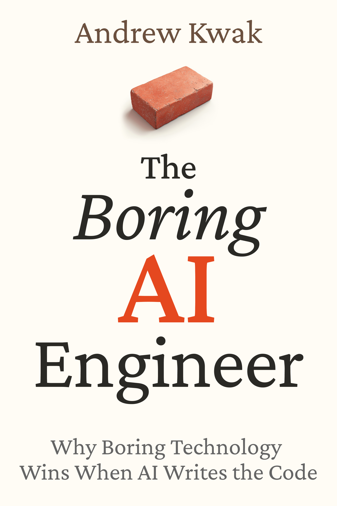

# The Boring Starter

Companion code for **_The Boring AI Engineer — Why Boring Technology Wins When AI Writes the Code_** by Andrew Kwak.

This is not a gem, not a framework, not a generator. It's the handful of files the book argues every AI-powered Rails app needs — small enough to read top to bottom, meant to be copied into your app and adapted. That's the philosophy: when you can read the code, you can check the agent's work.

## The files

| File | What it is | Book |
|---|---|---|
| `CONVENTIONS.md` | Standing orders for humans and agents. Drop in your repo root, first commit. | Appendix |
| `app/models/llm.rb` | The single front door for every model call: timeout, usage, retries, tenant-scoped cache. | Ch. 15, 18 |
| `app/models/agent_run.rb` | Agent state as a database row — status, steps, budget as columns. | Ch. 14 |
| `app/jobs/agent_run_job.rb` | The agent loop: a loop with a budget, failure never strands a run. | Ch. 14 |
| `app/jobs/summarize_job.rb` | Queue-shaped AI work: atomic claim to dedupe, release to recover. | Ch. 16 |
| `app/controllers/stripe_webhooks_controller.rb` | The money path: record first, act second, idempotent twice over. | Ch. 20 |

Names like `client`, `MODELS`, `Usage`, and `Summary` are deliberately left as reference shapes — wire them to your provider and your domain. The decisions are the product; the plumbing is yours.

## The Boring Rules

1. AI doesn't remove engineering decisions. It amplifies their consequences.
2. Churn is a business model. You are the customer, and the product is your migration.
3. Philosophy outlives syntax. Bet on the thing that hasn't changed its mind in two decades.
4. AI is a convention machine. Feed it conventions.
5. Every convention is a decision you don't have to make — and a prompt you don't have to write.
6. If it fits in one head, it fits in one context window. Keep it fitting.
7. Codebases rot from the data layer first. One idiom, no rot.
8. The fastest JavaScript is the JavaScript you didn't ship.
9. One server, one file, no ops team. That's not a toy — that's a business.
10. Perfect architecture is procrastination with diagrams. Perfect pixels are procrastination with Figma.
11. Start with three models. You can afford more when users demand them.
12. Don't predict the future. Make changing your mind cheap.
13. Complexity is bought with users, not anticipation.
14. An agent is a loop with a budget. Everything else is columns.
15. Treat the model like a database: call it through one door, cache it, time it out.
16. Slow AI belongs in a queue, not a request. Stream only for the blinking cursor.
17. If you can't eval it, you can't ship it. Test the plumbing, golden the shape, judge the judgment.
18. Rails.cache is the cheapest GPU.
19. The safest deploy is small, recent, and fully understood. Ship like it's saving a file.
20. Money is the swamp's deepest water. Cross it idempotent, logged, and twice-checked.
21. A backup you haven't restored is a wish.
22. Three alarms that mean it beat twenty you ignore. The intern gets a manager.
23. One framework, one database, one server, one person who understands it all.
24. Every yes is a ten-year contract. Make the no cheap, prepared, and polite — and adopt late, on purpose.
25. Tools change every year. Judgment compounds for decades.
26. Boring is not what's left when you fail to be exciting. It's what you choose when you intend to last.

## The book

The full argument — why the boring stack wins precisely when code gets cheap, and the field map of the swamp between a great demo and a product that survives it — is in the book.

**→ _The Boring AI Engineer_ — coming to Amazon (ebook + paperback).**

Published by Dearnode Press · [dearnode.com](https://dearnode.com)

## License

Code: MIT. Book text and the Boring Rules: © 2026 Andrew Kwak, quoted here with the author's blessing (he insisted).
